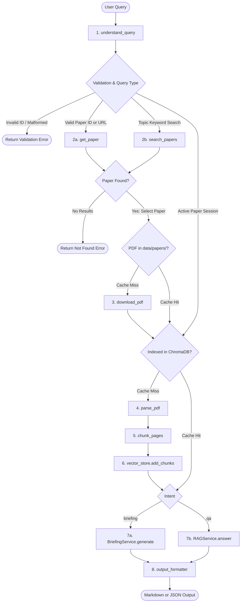

# Autonomous arXiv Paper Digest and QA Agent

A modular, state-driven research assistant designed to retrieve, download, parse, index, and synthesize academic papers from arXiv using Retrieval-Augmented Generation (RAG) with Google Gemini and ChromaDB.

---

## Overview

An end-to-end research assistant that ingests academic papers from arXiv to generate structured executive briefings and support grounded follow-up question-answering.

Key features:
* **Paper Identification & Retrieval**: Supports arXiv IDs (`2109.05633`, `2109.05633v1`), arXiv URLs, embedded IDs in natural queries, and topic keyword searches via the arXiv API.
* **Two-Tier Caching**: PDFs are cached locally under `data/papers/`, and vector embeddings persist in ChromaDB (`data/chroma/`) to bypass redundant downloads and embedding operations on repeated queries.
* **PDF Extraction & Cleaning**: Extracts page-level text using PyMuPDF while pruning trailing references and bibliography sections to avoid diluting retrieval quality.
* **Grounded RAG with Citations**: Retrieves relevant sliding-window chunks with strict negative constraints against hallucination, returning page-level citations.
* **Dual Output Formats**: Outputs formatted Markdown or machine-readable structured JSON.
* **Input Validation**: Validates inputs defensively at pipeline boundaries (handling empty queries, unsupported formats, invalid IDs, and API connection failures).

---

## Architecture and Pipeline State Machine

Rather than relying on an external workflow framework (such as LangGraph or CrewAI), the system implements an explicit, state-driven custom Python state machine as permitted by the assessment specification. Discrete functional nodes pass and mutate a typed `AgentState` dictionary, managing transitions, two-tier cache branches, defensive validation short-circuits, and multi-turn session persistence.

### System Pipeline



### Shared State Schema (`AgentState`)

The pipeline state is defined as a `TypedDict` in `app/state.py` and passed across functional nodes:

| State Key | Type | Description |
| :--- | :--- | :--- |
| `user_input` | `str` | Raw input text provided by the user. |
| `query_type` | `str` | Classified type: `"paper_id"`, `"topic"`, or `"invalid_paper_id"`. |
| `intent` | `Optional[str]` | Execution target: `"briefing"` or `"qa"`. |
| `paper_id` | `Optional[str]` | Canonical arXiv identifier (e.g., `2109.05633v1`). |
| `papers` | `List[Dict[str, Any]]` | Search results retrieved from arXiv API. |
| `selected_paper`| `Optional[Dict[str, Any]]` | Target paper metadata (title, authors, abstract, dates, PDF link). |
| `pdf_path` | `Optional[str]` | Local filesystem path to the downloaded PDF. |
| `pages` | `Optional[List[Dict[str, Any]]]` | Extracted text per page (excluding reference sections). |
| `chunks` | `List[Dict[str, Any]]` | Overlapping text chunks with page bounds and chunk IDs. |
| `briefing` | `Optional[str]` | Generated executive briefing text. |
| `output_format`| `Optional[str]` | Output target format: `"markdown"` or `"json"`. |
| `error` | `Optional[str]` | Error message if validation or an external call fails. |
| `conversation_history` | `List[Dict[str, str]]`| Multi-turn QA conversation log. |

---

## Project Structure

```text
arxiv-paper-agent/
├── app/
│   ├── __init__.py            # Package exports (ResearchPipeline, RAGService, etc.)
│   ├── arxiv_service.py       # arXiv API client with retry and error handling
│   ├── briefing_service.py    # Multi-query executive briefing synthesis
│   ├── chunking.py            # Sliding-window page-aware text chunking
│   ├── cli.py                 # Interactive terminal loop with prompt flushing
│   ├── llm_service.py         # Google GenAI client wrapper with model fallback chain
│   ├── output_formatter.py    # Markdown and JSON serializers with citation cleaning
│   ├── pdf_service.py         # PDF download and PyMuPDF text extraction
│   ├── pipeline.py            # Central ResearchPipeline state machine orchestrator
│   ├── query.py               # Input classification and word-boundary intent detection
│   ├── rag_service.py         # Retrieval-augmented question answering
│   ├── state.py               # TypedDict state definition
│   └── vector_store.py        # ChromaDB wrapper with version-agnostic candidate matching
├── data/
│   ├── chroma/                # Persistent vector database files (ignored by git)
│   └── papers/                # Downloaded PDF cache (ignored by git)
├── tests/
│   ├── __init__.py            # Test package marker
│   └── test_agent.py          # 25-test unit test suite (isolated, mocks external APIs)
├── .env                       # Environment secrets (ignored by git)
├── .env.example               # Configuration template
├── .gitignore                 # Standard repository exclusion rules
├── main.py                    # Root CLI entrypoint
├── requirements.txt           # Dependency requirements file
└── README.md                  # System documentation
```

---

## Installation and Setup

### Prerequisites
* Python 3.10 or higher
* Gemini API Key (available from [Google AI Studio](https://aistudio.google.com/))

### Virtual Environment Configuration

```bash
# Clone the repository
git clone <repository-url>
cd arxiv-paper-agent

# Create and activate virtual environment
python -m venv .venv

# On Windows:
.venv\Scripts\activate

# On macOS/Linux:
source .venv/bin/activate

# Install dependencies
pip install -r requirements.txt
```

### Environment Configuration

Create a `.env` file in the project root:

```env
GEMINI_API_KEY=your_gemini_api_key_here
GEMINI_MODEL=gemini-3.5-flash-lite
```

`GEMINI_MODEL` is optional and defaults to `gemini-3.5-flash-lite` (supported options include `gemini-3.5-flash-lite`, `gemini-2.5-flash`, and `gemini-flash-latest`).

#### Free-Tier Quota Resilience & Automatic Fallback
Testing with Google AI Studio's free tier operates under standard quotas:
* **Automatic Model Fallback Chain**: To safeguard against transient rate limits (`429 RESOURCE_EXHAUSTED`) or model tier deprecations, `LLMService` automatically cascades through an active fallback list (`gemini-3.5-flash-lite` -> `gemini-2.5-flash` -> `gemini-flash-latest`), ensuring the pipeline does not fail mid-session.
* **Two-Tier Cache Elimination**: The system's two-tier caching architecture (local PDF caching and persistent ChromaDB vector storage with version-agnostic candidate matching) minimizes redundant external calls on repeated queries.

---

## Usage

### 1. Interactive Terminal Interface

To run the interactive CLI:

```bash
python main.py
```

The workflow:
1. Prompts for an arXiv ID (e.g. `2109.05633`), full URL, or research topic.
2. Retrieves, downloads, parses, and indexes the paper.
3. Prints the Executive Briefing.
4. Enters an interactive QA session for follow-up questions.
5. Type `new` to analyze another paper or `exit` to quit.

### 2. Programmatic Python API

```python
from app.pipeline import ResearchPipeline

pipeline = ResearchPipeline()

# 1. Generate Executive Briefing in Markdown
briefing = pipeline.run(
    user_input="Give me an executive briefing of 2109.05633",
    output_format="markdown"
)
print(briefing)

# 2. Ask a Grounded Follow-up Question
answer = pipeline.run(
    user_input="What 3D body model was used during simulation?",
    paper_id="2109.05633v1",
    output_format="markdown"
)
print(answer)

# 3. Retrieve Structured JSON
json_output = pipeline.run(
    user_input="Summarize 2109.05633",
    output_format="json"
)
print(json_output)
```

---

## Example Run (End-to-End CLI Session)

The following transcript represents an authentic, continuous terminal session (`python main.py`) analyzing arXiv paper `2109.05633`, followed by 3 grounded QA exchanges demonstrating factual retrieval, algorithmic detail, and negative constraint handling.

*Note on Architecture Guarantees*: The top-level metadata header (Title, Authors, arXiv ID, Published Date, Link) and the citation footer (`## Sources` with exact page numbers) are extracted and injected deterministically by the Python formatting pipeline. The narrative analysis sections and answers are synthesized dynamically by Google Gemini grounded on the retrieved ChromaDB chunks.

```text
(.venv) (base) PS C:\Users\adwai\OneDrive\Documents\LPU\arxiv-paper-agent> python main.py                
                                                                                                         ======================================================================
Autonomous arXiv Paper Digest & QA Agent
======================================================================
Enter an arXiv ID, URL, or research topic to generate an Executive Briefing.
Type 'exit' or 'quit' at any prompt to stop.

Warning: You are sending unauthenticated requests to the HF Hub. Please set a HF_TOKEN to enable higher r
ate limits and faster downloads.                                                                         Loading weights: 100%|███████████████████████████████████████████████████████████████████████████████████
█████| 103/103 [00:00<00:00, 1093.01it/s]                                                                Research Topic or arXiv ID > 2109.05633

Processing paper (retrieving, parsing, indexing)... Please wait.
Direct use of automatic function calling (AFC) in Models.generate_content is not recommended. Instead, we
 recommend to use AFC in Chat.send_message. Similarly, direct use of AFC in Models.generate_content_stream is not recommended. Instead, we recommend to use AFC in Chat.send_message_stream.                      
======================================================================
# Executive Briefing: Generating Datasets of 3D Garments with Sewing Patterns

**Authors:** Maria Korosteleva, Sung-Hee Lee | **arXiv ID:** `2109.05633v1` | **Published:** 2021-09-12T2
3:03:48+00:00 | **Link:** https://arxiv.org/pdf/2109.05633v1                                             
## Why This Paper Matters
While deep learning models for rigid objects and human meshes have advanced significantly, structured def
ormable objects like clothing lack large-scale datasets that pair 3D garment models with their underlying structural sewing patterns. This paper introduces a flexible, automated generation pipeline and a domain-specific template language to produce large datasets of diverse 3D garments with corresponding sewing patterns. By providing over 20,000 synthetic garment design variations complete with segmentation labels and simulated 3D scanning artifacts, this work bridges a critical gap for deep learning research in neural 3D garment modeling, reconstruction, and structure estimation.                                           
## Problem Statement
The research challenges addressed by the paper include:
- A scarcity of large-scale datasets providing garment sewing patterns alongside 3D garment models or ren
ders.                                                                                                    - Existing synthetic or real-world garment datasets offer limited design variations, sparse samples, or r
ely on 3D cut-and-rearrange methods that fail to guarantee physically correct garment drapes.            - Existing datasets lack alignment with noisy, in-the-wild 3D scan data, as they typically only provide c
lean, complete artificial meshes.                                                                        - The need for datasets that can train deep learning models to generalize across complex structures like 
variable-length sewing patterns, structured deformable panels, cross-references (stitches), and novel topologies.                                                                                                 
## Method & Approach
The paper proposes an automated data generation pipeline split into a flexible template specification sys
tem and an automatic dataset construction workflow:                                                      - **JSON-Based Pattern Template Specification:** Defines a human-readable domain-specific format consisti
ng of a base sewing pattern (unordered panels of 2D vertices, ordered oriented edge loops forming Bezier curves or lines, global translations/rotations, and stitches joining edges), parameter rules, and optional edge-consistency constraints.                                                                          - **Rule-Based Parameterization:** Operates at the panel edge level (modifying edge length or curvature c
oordinates via multiplicative or additive rules with specified ranges and vectors) to enable symmetric/asymmetric changes and independent or simultaneous variations.                                             - **Automated Sampling & Pre-processing:** Samples individual patterns from templates, filters out topolo
gical errors like self-intersecting panels, and pre-processes patterns to ensure consistency (sorting panels by 3D coordinates, enforcing counterclockwise edge loops, and standardizing the first edge originating from the lowest-leftmost vertex).                                                                      - **Physics Simulation Draping:** Utilizes Qualoth as a base physics simulator to drape pattern samples o
ver a standardized human body model (average female SMPL body model in T-pose) with fixed material properties, producing OBJ 3D meshes with per-vertex segmentation labels.                                       - **3D Scanning Artifact Imitation:** Post-processes clean simulated meshes to mimic real-world occlusion
s by placing garment and body models in a virtual box and removing faces invisible to random rays shot from surface centers (using approximately 10% visible ray thresholds).                                     
## Key Results & Claims
- **Large-Scale Dataset Created:** Produced a public dataset containing 23,500 total garment design sampl
es (22,547 successfully passing simulation quality checks) distributed under CC BY 4.0 on Zenodo.        - **Template Diversity:** Built 19 sewing pattern templates divided into a training group (12 templates c
overing simple garments like skirts, dresses, tops, pants, jackets, hoodies, and jumpsuits with 1,000 to 2,700 samples each) and a test group (7 templates specifically designed to evaluate generalization across novel sewing pattern topologies by rearranging training parts into new configurations, with 150 samples each).                                                                                                   - **Computational Efficiency:** The automated pipeline achieves a generation throughput where the sewing 
pattern sampling stage generates ~1,300 designs per minute, with individual garment processing taking ~3 minutes for simulation, 45 seconds for scan imitation, and 1 minute for rendering.                       
## Limitations
- **Fixed Environmental Parameters:** The current pipeline keeps material properties, body shape, and bod
y pose fixed after generation, omitting automatic sampling for these variations.                         - **Omission of Fine Details:** Fine features of sewing pattern design such as darts, pleats, or complex 
edge curves are omitted from the current generation templates.                                           - **Restricted Garment Arrangements:** Complex garment arrangements—such as fabric layering (e.g., ballro
om skirts), accessories, overlaying multiple garments, and complex materials like thick winter coats—are not currently represented.                                                                               
## Future Work
- Enrich the data generation pipeline to cover skipped fine features such as darts, pleats, and complex e
dge curves.                                                                                              - Provide a broader range of base parametric templates.
- Incorporate complex garment arrangements such as fabric layering, accessories, multi-garment overlaying
, and complex materials (e.g., thick winter coats).                                                      
## Suggested Follow-up Questions
1. How does enforcing strict structural pre-processing rules (such as sorting panels by 3D coordinates an
d standardizing edge loops) affect the diversity or realism of the generated patterns?                   2. What specific deep learning architectures or tasks are best suited to handle the variable-length, stru
ctured nature of sewing patterns combined with cross-reference stitch data as inputs or outputs?         3. How effectively do models trained on clean simulated meshes combined with the 3D scanning artifact imi
tation pipeline generalize to actual real-world "in-the-wild" scan captures?                             4. In what ways might expanding the pipeline to handle dynamic body poses and diverse human body shapes (
beyond a fixed SMPL T-pose) impact simulation stability and failure rates?                               
## Sources

- Paper: `2109.05633v1` | Pages: 6, 7
- Paper: `2109.05633v1` | Page: 9
- Paper: `2109.05633v1` | Pages: 5, 6
- Paper: `2109.05633v1` | Pages: 7, 8
- Paper: `2109.05633v1` | Page: 7
- Paper: `2109.05633v1` | Pages: 4, 5
- Paper: `2109.05633v1` | Page: 5
- Paper: `2109.05633v1` | Pages: 8, 9
- Paper: `2109.05633v1` | Pages: 2, 3
- Paper: `2109.05633v1` | Page: 2
- Paper: `2109.05633v1` | Pages: 3, 4
- Paper: `2109.05633v1` | Pages: 1, 2

======================================================================

QA Mode Active - You can now ask follow-up questions about this paper (2109.05633v1).
Type 'new' to analyze a different paper, or 'exit' to quit.

Follow-up Question > what 3-D model was used during data generation?

Retrieving grounded context from paper...

----------------------------------------------------------------------


Based on the provided context, the paper mentions that a "body model" is used for draping the sewing patt
ern samples during data generation, and notes that "generally speaking, any 3D object can be used as a body model, but it is recommended to use the same body model that the template panels were placed around". However, the specific name, shape, or type of the 3-D body model is not provided in the text.            
## Sources

- Paper: `2109.05633v1` | Pages: 3, 4
- Paper: `2109.05633v1` | Pages: 1, 2
- Paper: `2109.05633v1` | Page: 7
- Paper: `2109.05633v1` | Pages: 8, 9
- Paper: `2109.05633v1` | Pages: 6, 7

----------------------------------------------------------------------

Follow-up Question > which dataset is used?

Retrieving grounded context from paper...

----------------------------------------------------------------------
# Answer

Based on the provided paper context, the authors introduce and use their own synthetically generated data
set comprising more than 20,000 garment designs. This dataset was created using a data generation pipeline based on 19 originally designed garment templates (divided into a training group of 12 templates and a test group of 7 templates), utilizing an average female body model provided by SMPL in T-pose.           
## Sources

- Paper: `2109.05633v1` | Pages: 2, 3
- Paper: `2109.05633v1` | Pages: 7, 8
- Paper: `2109.05633v1` | Pages: 8, 9
- Paper: `2109.05633v1` | Pages: 4, 5
- Paper: `2109.05633v1` | Pages: 3, 4

----------------------------------------------------------------------

Follow-up Question > exit
Exiting. Happy researching!
```

---

## Design Decisions and Tradeoffs

### 1. Handling Topic Queries and arXiv Candidate Volume
* **Decision**: Inputs are bifurcated into exact identifiers (`paper_id`) and broader keyword topics (`topic`). Topic searches query the official arXiv API sorted by relevance, fetching the top 5 candidates and selecting the highest-ranked paper.
* **Tradeoff**: Highly ambiguous keywords (e.g., `"deep learning"`) return a large candidate set where the first result may not align with user intent. An interactive disambiguation menu could be used, but selecting the top-ranked paper minimizes interactive latency for automated workflows.
* **Malformed ID Detection**: Inputs resembling paper identifiers (e.g., `999.999`, `2109.56`) but failing exact arXiv syntax are caught defensively and rejected with actionable error messages, preventing typos from silently falling through to arbitrary topic keyword searches.
* **Zero Results**: If arXiv returns no matches, the pipeline terminates early with an informative error dictionary rather than executing downstream extraction steps.

### 2. PDF Extraction and Layout Handling
* **Decision**: PyMuPDF (`pymupdf`) was selected over OCR and rule-based layout parsers due to execution speed and page-tracking consistency.
* **Reference Pruning**: The parser identifies headings matching `^(references|bibliography)$` and discards trailing pages. This avoids embedding hundreds of raw citation lines that dilute retrieval precision.
* **Failure Handling**: If a PDF is corrupted or purely image-based (no selectable text stream), the parser returns an empty page list, prompting the pipeline to return an error before attempting chunking.

### 3. Hallucination Prevention and Retrieval Grounding
* **Decision**: Prompts enforce negative constraints: `"Answer the user's question using ONLY the provided paper context. If the context does not contain enough information, say so clearly. Do not invent facts."`
* **Metadata Tracking**: Chunking preserves `(chunk_id, paper_id, pages)`. Responses must provide deduplicated citations linking answers to exact page numbers.

### 4. State Persistence and Multi-Tier Caching
* **Decision**:
  * Persistent ChromaDB vector store (`data/chroma/`) ensures embeddings remain available across process runs.
  * The `VectorStore.has_paper(paper_id)` check prevents re-parsing and re-embedding papers on subsequent calls.
  * Local PDF caching (`data/papers/`) prevents redundant network downloads.
* **Tradeoff**: Local embedded storage removes dependencies on external database infrastructure, maintaining reproducibility in local development environments.

### 5. Identified Limitations and Future Work
* **Re-ranking Stage**: Adding a cross-encoder re-ranking step (e.g., BGE-Reranker) after vector retrieval would improve precision for fine-grained technical queries.
* **Multimodal Extraction**: Integrating visual document models to parse architectural figures, equations, and tables from PDFs.
* **Multi-Paper Synthesis**: Expanding the briefing node to compare multiple papers simultaneously for comparative literature reviews.

---

## Automated Testing Suite

The test suite runs with Python's standard `unittest` framework and requires no external network access or API credentials (running all **25 tests in ~0.11 seconds**):

```bash
python -m unittest discover tests -v
# or
python -m unittest tests/test_agent.py -v
```

### Test Coverage (25 Unit Tests)
* **Query Parsing & Intent Classification**: arXiv ID extraction (standard, versioned, embedded in natural language, and `arXiv:` prefix stripping), URL parsing, topic keyword detection, and word-boundary regex intent classification (`briefing` vs `qa`) that prevents false positive substring triggers on terms like `distillation` or `domain`.
* **Chunking**: Sliding-window boundaries, token overlaps, and page boundary preservation.
* **Output Formatting & Citations**: Citation deduplication and normalization, page range parsing, Markdown synthesis, and structured JSON serialization with metadata extraction.
* **Defensive Validation & Resilience**: Input sanitization, malformed arXiv ID rejection (e.g. `999.999`, `2109.56`, calendar month validation for `2113.05633`), unsupported format handling, 0-byte corrupted PDF handling, and TOC-safe bibliography pruning with appendix retention.
* **Vector Store Caching**: Version-agnostic candidate ID matching (`2109.05633` vs `2109.05633v1` through `v10`) ensuring seamless cache hits across unversioned and versioned queries.

---

## Video Walkthrough

The 4-minute technical demonstration and reflection covering architecture decisions, caching mechanisms, executive briefing generation, and grounded QA is available here:
* **Walkthrough Video**: [Link to Video](https://www.loom.com/share/e97af23b71c44f3da0ac790c873de6c1)

