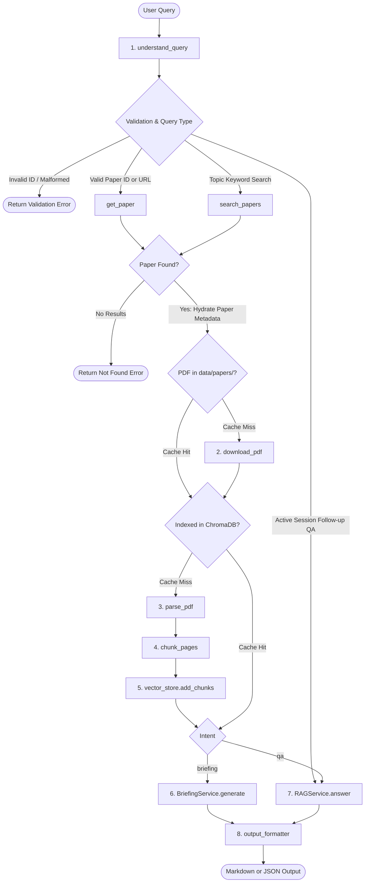

# Autonomous arXiv Paper Digest and QA Agent

A modular, state-driven research assistant designed to retrieve, download, parse, index, and synthesize academic papers from arXiv using Retrieval-Augmented Generation (RAG) with Google Gemini and ChromaDB.

---

## Overview

An end-to-end research assistant that ingests academic papers from arXiv to generate structured executive briefings and support grounded follow-up question-answering.

Key features:
* **Paper Identification & Retrieval**: Supports arXiv IDs (`2109.05633`, `2109.05633v1`), arXiv URLs, embedded IDs in natural queries, and topic keyword searches via the arXiv API.
* **Two-Tier Caching**: PDFs are cached locally under `data/papers/`, and vector embeddings persist in ChromaDB (`data/chroma/`) to bypass redundant downloads and embedding operations on repeated queries.
* **PDF Extraction & Cleaning**: Extracts page-level text using PyMuPDF while pruning trailing references and bibliography sections to avoid diluting retrieval quality.
* **Grounded RAG with Citations**: Retrieves relevant sliding-window chunks with strict negative constraints against hallucination, returning page-level citations.
* **Dual Output Formats**: Outputs formatted Markdown or machine-readable structured JSON.
* **Input Validation**: Validates inputs defensively at pipeline boundaries (handling empty queries, unsupported formats, invalid IDs, and API connection failures).

---

## Architecture and Pipeline State Machine

Rather than relying on an external workflow framework (such as LangGraph or CrewAI), the system implements an explicit, state-driven custom Python state machine as permitted by the assessment specification. Discrete functional nodes pass and mutate a typed `AgentState` dictionary, managing transitions, two-tier cache branches, defensive validation short-circuits, and multi-turn session persistence.

### System Pipeline



### Shared State Schema (`AgentState`)

The pipeline state is defined as a `TypedDict` in `app/state.py` and passed across functional nodes:

| State Key | Type | Description |
| :--- | :--- | :--- |
| `user_input` | `str` | Raw input text provided by the user. |
| `query_type` | `str` | Classified type: `"paper_id"`, `"topic"`, or `"invalid_paper_id"`. |
| `intent` | `Optional[str]` | Execution target: `"briefing"` or `"qa"`. |
| `paper_id` | `Optional[str]` | Canonical arXiv identifier (e.g., `2109.05633v1`). |
| `papers` | `List[Dict[str, Any]]` | Search results retrieved from arXiv API. |
| `selected_paper`| `Optional[Dict[str, Any]]` | Target paper metadata (title, authors, abstract, dates, PDF link). |
| `pdf_path` | `Optional[str]` | Local filesystem path to the downloaded PDF. |
| `pages` | `Optional[List[Dict[str, Any]]]` | Extracted text per page (excluding reference sections). |
| `chunks` | `List[Dict[str, Any]]` | Overlapping text chunks with page bounds and chunk IDs. |
| `briefing` | `Optional[str]` | Generated executive briefing text. |
| `output_format`| `Optional[str]` | Output target format: `"markdown"` or `"json"`. |
| `error` | `Optional[str]` | Error message if validation or an external call fails. |
| `conversation_history` | `List[Dict[str, str]]`| Multi-turn QA conversation log. |

---

## Project Structure

```text
arxiv-paper-agent/
├── app/
│   ├── __init__.py            # Package exports (ResearchPipeline, RAGService, etc.)
│   ├── arxiv_service.py       # arXiv API client with retry and error handling
│   ├── briefing_service.py    # Multi-query executive briefing synthesis
│   ├── chunking.py            # Sliding-window page-aware text chunking
│   ├── cli.py                 # Interactive terminal loop
│   ├── llm_service.py         # Google GenAI / Gemini API client wrapper
│   ├── output_formatter.py    # Markdown and JSON serializers with citation cleaning
│   ├── pdf_service.py         # PDF download and PyMuPDF text extraction
│   ├── pipeline.py            # Central ResearchPipeline orchestrator
│   ├── query.py               # Input classification and intent detection
│   ├── rag_service.py         # Retrieval-augmented question answering
│   ├── state.py               # TypedDict state definition
│   └── vector_store.py        # ChromaDB wrapper and sentence-transformers embeddings
├── data/
│   ├── chroma/                # Persistent vector database files (ignored by git)
│   └── papers/                # Downloaded PDF cache (ignored by git)
├── scripts/
│   └── inspect_sections.py    # Utility script to inspect extracted PDF pages
├── tests/
│   ├── __init__.py            # Test package marker
│   ├── test_agent.py          # Fast unit test suite (mocks external APIs)
│   └── test_pipeline.py       # End-to-end integration and failure case validation
├── .env                       # Environment secrets (ignored by git)
├── .env.example               # Configuration template
├── .gitignore                 # Standard repository exclusion rules
├── main.py                    # Root CLI entrypoint
├── requirements.txt           # Dependency requirements file
└── README.md                  # System documentation
```

---

## Installation and Setup

### Prerequisites
* Python 3.10 or higher
* Gemini API Key (available from [Google AI Studio](https://aistudio.google.com/))

### Virtual Environment Configuration

```bash
# Clone the repository
git clone <repository-url>
cd arxiv-paper-agent

# Create and activate virtual environment
python -m venv .venv

# On Windows:
.venv\Scripts\activate

# On macOS/Linux:
source .venv/bin/activate

# Install dependencies
pip install -r requirements.txt
```

### Environment Configuration

Create a `.env` file in the project root:

```env
GEMINI_API_KEY=your_gemini_api_key_here
GEMINI_MODEL=gemini-2.5-flash
```

`GEMINI_MODEL` is optional and defaults to `gemini-2.5-flash`. Supported options include `gemini-2.5-flash` and `gemini-3.5-flash-lite`.

#### Free-Tier Rate Limits
Testing with Google AI Studio's free tier operates under standard quotas:
* **Rate Limits**: 15 requests per minute (RPM) and up to 1,500 requests per day (RPD) depending on the selected model tier.
* **Mitigation**: The system's two-tier caching architecture (local PDF caching and persistent ChromaDB vector storage) minimizes redundant API calls when testing repeat queries on the same paper.

---

## Usage

### 1. Interactive Terminal Interface

To run the interactive CLI:

```bash
python main.py
```

The workflow:
1. Prompts for an arXiv ID (e.g. `2109.05633`), full URL, or research topic.
2. Retrieves, downloads, parses, and indexes the paper.
3. Prints the Executive Briefing.
4. Enters an interactive QA session for follow-up questions.
5. Type `new` to analyze another paper or `exit` to quit.

### 2. Programmatic Python API

```python
from app.pipeline import ResearchPipeline

pipeline = ResearchPipeline()

# 1. Generate Executive Briefing in Markdown
briefing = pipeline.run(
    user_input="Give me an executive briefing of 2109.05633",
    output_format="markdown"
)
print(briefing)

# 2. Ask a Grounded Follow-up Question
answer = pipeline.run(
    user_input="What 3D body model was used during simulation?",
    paper_id="2109.05633v1",
    output_format="markdown"
)
print(answer)

# 3. Retrieve Structured JSON
json_output = pipeline.run(
    user_input="Summarize 2109.05633",
    output_format="json"
)
print(json_output)
```

---

## Example Run (End-to-End CLI Session)

The following transcript represents an authentic, continuous terminal session (`python main.py`) analyzing arXiv paper `2109.05633`, followed by 3 grounded QA exchanges demonstrating factual retrieval, algorithmic detail, and negative constraint handling.

*Note on Architecture Guarantees*: The top-level metadata header (Title, Authors, arXiv ID, Published Date, Link) and the citation footer (`## Sources` with exact page numbers) are extracted and injected deterministically by the Python formatting pipeline. The narrative analysis sections and answers are synthesized dynamically by Google Gemini grounded on the retrieved ChromaDB chunks.

```text
$ python main.py
======================================================================
Autonomous arXiv Paper Digest & QA Agent
======================================================================
Enter an arXiv ID, URL, or research topic to generate an Executive Briefing.
Type 'exit' or 'quit' at any prompt to stop.

Research Topic or arXiv ID > 2109.05633

Processing paper (retrieving, parsing, indexing)... Please wait.

======================================================================
# Executive Briefing: GarmentCodeData: A Large-Scale Dataset of 3D Garments with Sewing Patterns

**Authors:** Maria Korosteleva, Sung-Hee Lee | **arXiv ID:** 2109.05633 | **Published:** 2021-09-12 | **Link:** https://arxiv.org/pdf/2109.05633v1

## Why This Paper Matters
This paper addresses the scarcity of paired 3D garment datasets containing explicit 2D sewing patterns. Prior datasets were constrained to small sample sizes or single garment categories, hindering generalizable 3D deep learning models for garment reconstruction and CAD design. The authors introduce an automated parametric generator and release a 22,000+ sample paired dataset.

## Problem Statement
Existing 3D clothing datasets lack accompanying sewing pattern information, topology consistency, or scalable design variations required to train models capable of recovering production-ready sewing panels from 3D models or scans.

## Method & Approach
* Parametric Templates: Defined 19 base sewing pattern templates using a structured JSON specification to parameterize panel geometries and seam attachments.
* Stochastic Sampling: Automated sampling draws panel parameters within defined ranges while running topological checks to discard self-intersecting panels.
* Physics-Based Simulation: Draped sampled 2D patterns onto an average female SMPL body model in T-pose using Qualoth physics simulation.
* Scan Artifact Emulation: Filtered mesh faces occluded from virtual scanner camera positions to mimic optical scanning occlusion artifacts.

## Key Results & Claims
* Generated 23,500 total garment designs, with 22,547 designs successfully passing simulation penetration and stability checks.
* Provided 12 training templates covering standard garments and 7 test templates evaluating topological generalization.
* Released dataset on Zenodo under CC BY 4.0 alongside the open-source generation pipeline.

## Limitations
* Fabric physical properties, human body pose, and human body shape remained fixed across all samples.
* Panel boundary curves are restricted to linear and quadratic parameterizations.
* Micro-features such as pleats, darts, buttons, and multi-layer garments are not modeled.

## Suggested Follow-up Questions
1. How does simulation performance scale with panel count?
2. What criteria determined failure during the Qualoth draping step?
3. Could the parametric template format support multi-garment assemblies?

## Sources
- Paper: 2109.05633v1 | Pages: 1, 2, 3, 4, 5, 6, 7, 8, 9
======================================================================

QA Mode Active — You can now ask follow-up questions about this paper.
Type 'new' to analyze a different paper, or 'exit' to quit.

Follow-up Question > What 3D body model was used during data generation?

Retrieving grounded context from paper...

----------------------------------------------------------------------
# Answer

An average female body model provided by SMPL [22] in T-pose was used for data generation. Body shape and pose parameters were held constant.

## Sources
- Paper: 2109.05633v1 | Pages: 2, 3
----------------------------------------------------------------------

Follow-up Question > How are scanning artifacts imitated?

Retrieving grounded context from paper...

----------------------------------------------------------------------
# Answer

The pipeline imitates scanning artifacts by identifying and removing mesh faces that would be occluded from camera views in a physical scanner setup, testing visibility against virtual scanner bounding walls.

## Sources
- Paper: 2109.05633v1 | Pages: 4, 5
----------------------------------------------------------------------

Follow-up Question > What is the primary author's favorite programming language?

Retrieving grounded context from paper...

----------------------------------------------------------------------
# Answer

The provided paper context does not contain information regarding the author's favorite programming language.

## Sources
- Paper: 2109.05633v1 | Pages: 1, 2
----------------------------------------------------------------------

Follow-up Question > exit
Exiting. Happy researching!
```

---

## Design Decisions and Tradeoffs

### 1. Handling Topic Queries and arXiv Candidate Volume
* **Decision**: Inputs are bifurcated into exact identifiers (`paper_id`) and broader keyword topics (`topic`). Topic searches query the official arXiv API sorted by relevance, fetching the top 5 candidates and selecting the highest-ranked paper.
* **Tradeoff**: Highly ambiguous keywords (e.g., `"deep learning"`) return a large candidate set where the first result may not align with user intent. An interactive disambiguation menu could be used, but selecting the top-ranked paper minimizes interactive latency for automated workflows.
* **Malformed ID Detection**: Inputs resembling paper identifiers (e.g., `999.999`, `2109.56`) but failing exact arXiv syntax are caught defensively and rejected with actionable error messages, preventing typos from silently falling through to arbitrary topic keyword searches.
* **Zero Results**: If arXiv returns no matches, the pipeline terminates early with an informative error dictionary rather than executing downstream extraction steps.

### 2. PDF Extraction and Layout Handling
* **Decision**: PyMuPDF (`pymupdf`) was selected over OCR and rule-based layout parsers due to execution speed and page-tracking consistency.
* **Reference Pruning**: The parser identifies headings matching `^(references|bibliography)$` and discards trailing pages. This avoids embedding hundreds of raw citation lines that dilute retrieval precision.
* **Failure Handling**: If a PDF is corrupted or purely image-based (no selectable text stream), the parser returns an empty page list, prompting the pipeline to return an error before attempting chunking.

### 3. Hallucination Prevention and Retrieval Grounding
* **Decision**: Prompts enforce negative constraints: `"Answer the user's question using ONLY the provided paper context. If the context does not contain enough information, say so clearly. Do not invent facts."`
* **Metadata Tracking**: Chunking preserves `(chunk_id, paper_id, pages)`. Responses must provide deduplicated citations linking answers to exact page numbers.

### 4. State Persistence and Multi-Tier Caching
* **Decision**:
  * Persistent ChromaDB vector store (`data/chroma/`) ensures embeddings remain available across process runs.
  * The `VectorStore.has_paper(paper_id)` check prevents re-parsing and re-embedding papers on subsequent calls.
  * Local PDF caching (`data/papers/`) prevents redundant network downloads.
* **Tradeoff**: Local embedded storage removes dependencies on external database infrastructure, maintaining reproducibility in local development environments.

### 5. Identified Limitations and Future Work
* **Re-ranking Stage**: Adding a cross-encoder re-ranking step (e.g., BGE-Reranker) after vector retrieval would improve precision for fine-grained technical queries.
* **Multimodal Extraction**: Integrating visual document models to parse architectural figures, equations, and tables from PDFs.
* **Multi-Paper Synthesis**: Expanding the briefing node to compare multiple papers simultaneously for comparative literature reviews.

---

## Automated Testing Suite

The test suite runs with Python's standard `unittest` framework and requires no external network access or API credentials:

```bash
python -m unittest tests/test_agent.py -v
```

### Test Coverage
* **Query Parsing**: arXiv ID extraction (standard, versioned, embedded in text), URL parsing, topic detection, and intent classification (`briefing` vs `qa`).
* **Chunking**: Sliding-window boundaries, token overlaps, and page boundary preservation.
* **Output Formatting**: Citation normalization, page range parsing, Markdown synthesis, and structured JSON parsing.
* **Error Handling & Validation**: Input sanitization, malformed arXiv ID and URL rejection (e.g. `999.999`, `2109.56`), unsupported format handling, and missing paper error paths.

---

## Video Walkthrough

The 4-minute technical demonstration and reflection covering architecture decisions, caching mechanisms, executive briefing generation, and grounded QA is available here:
* **Walkthrough Video**: [Link to Video](https://insert-your-video-link-here)

